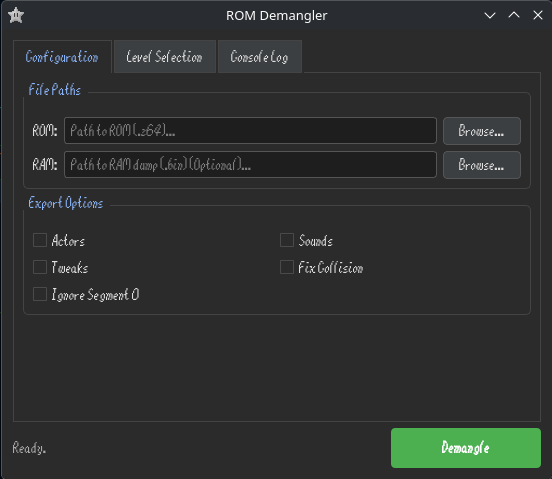

# ROM Demangler

A tool made in C++ that allows you to export data from SM64 ROMs to a sm64coopdx romhack.

# How to Use

## Terminal

Run the tool via your command line interface. Depending on your operating system, the executable will be `./ROMDemangler.exe` for Windows or `./ROMDemangler` for Linux/macOS.

### Command Options:

`--rom <file>`: Specify the target ROM file (e.g., `--rom name.z64`).

`--levels <list>`: Choose the levels to export. You can specify a single level (e.g., `--levels 2`) or a comma-separated list (e.g., `--levels 2,3,5`).

`--actors <type>`: Define which actors to export. Valid options are `all`, `custom`, or `vanilla` (e.g., `--actors all`).

`--custom-symbols <file>`: Path to a JSON symbol file that overrides entries from symbolMap.json. Useful for romhacks that rename or add symbols (e.g., --custom-symbols myhack_symbols.json).

### Example Usage:

`
./ROMDemangler.exe --rom myhack.z64 --levels 2,3,5 --actors custom`

## GUI

Install the required dependency:

`pip install PyQt6`

Run the GUI (Or just open the file with explorer) :

`python ROMDemanglerGUI.py`

The GUI provides a graphical interface for configuring and running ROM Demangler without using a terminal:

# Credits:
- [stb_image_write](https://github.com/nothings/stb/blob/master/stb_image_write.h) by [nothings](https://github.com/nothings) - Used for exporting textures
- [cxxopts](https://github.com/jarro2783/cxxopts) by [jarro2783](https://github.com/jarro2783) - Library for parsing CLI arguments
- [nlohmann/json](https://github.com/nlohmann/json) by [nlohmann](https://github.com/nlohmann) - Library for reading/writing the JSON symbol map
- [RM2C](https://gitlab.com/scuttlebugraiser/rom-manger-2-c) by [scuttlebugraiser](https://gitlab.com/scuttlebugraiser) - References for scrolling textures, collision fixes and segment2 related stuff
- [Quad64](https://github.com/DavidSM64/Quad64) by [DavidSM64](https://github.com/DavidSM64) - Per-area bank 0x0E functions

But you might like Isaac's tool more: https://github.com/Isaac0-dev/rom-decomp-64